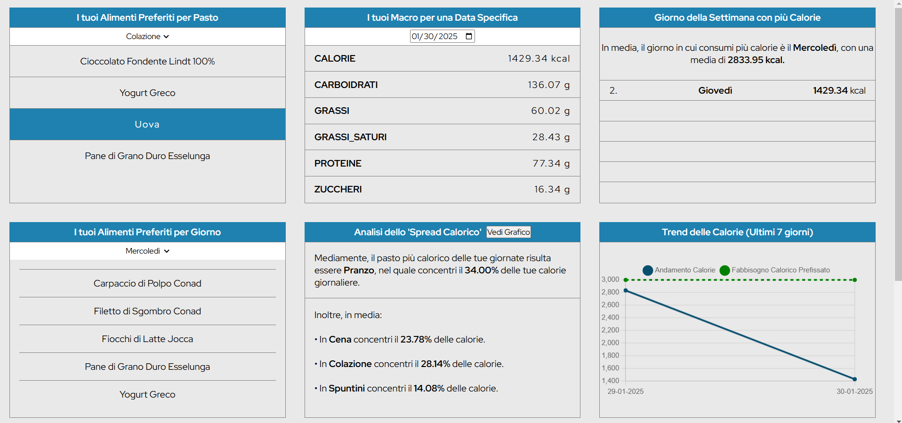

# 📊 Personalized Calorie Tracking Dashboard

This project is a **highly customized calorie tracking application** built to analyze and optimize my daily nutrition. Unlike generic tracking apps, this **dashboard is tailored to my personal needs**, providing **deep insights** into my eating habits, macronutrient distribution, and goal tracking.  

## 🚀 Features  

### 🔍 **Personalized Food Insights**  
- View the most frequently consumed foods based on meal type (Breakfast, Lunch, Dinner, Snacks).  
- Click on any food item to get **detailed insights**, including:  
  - The dominant nutrient in that food.  
  - The **percentage of total daily calories** that food represents.  
  - The **percentage of its main macronutrient** relative to the daily average.  
  - Consumption frequency in the last **7 and 30 days**.  

### 📅 **Day-Based Analysis**  
- See **which day of the week** I consume the most calories (with a ranking of all days).  
- Find **preferred foods by weekday**, including:  
  - The most commonly paired food items in the same meal.  
  - The frequency of these food combinations.  

### 📈 **Macronutrient & Caloric Trends**  
- Visualize total macronutrient intake for a **specific date**.  
- Track **calorie trends over the last 7 days**.  
- Analyze **macronutrient trends** over **7 or 30 days** with interactive graphs.  

### ⚖️ **Caloric Distribution Analysis**  
- View how calories are distributed across different meals (Pie Chart visualization).  

### 🎯 **Goal Tracking**  
- Set and monitor **macronutrient goals** (e.g., at least 180g of protein per day).  
- Track progress over the last 7 days.  

## 🛠️ Tech Stack  

- **Frontend**: HTML, CSS, JavaScript  
- **Backend**: Flask (Python)  
- **Database**: PostgreSQL  

## 📷 UI Preview  

Here are some previews of the dashboard in action:  

### 🏠 Home 
  

### 🍽️ Dashboard
  
  
---

This project reflects my skills in **data analysis and fitness-tech solutions**. If you're interested in similar custom dashboards or want to explore data-driven fitness solutions, feel free to connect!  

👥 **Connect with me:**  
🔗 LinkedIn: https://www.linkedin.com/feed/update/urn:li:activity:7247265852452986880/  
🙠YouTube: https://www.youtube.com/@valeriocaselli4   
📷 Instagram: https://www.instagram.com/valeriocaselli_/   
✍️ Blog: https://valeriocaselli.com/
